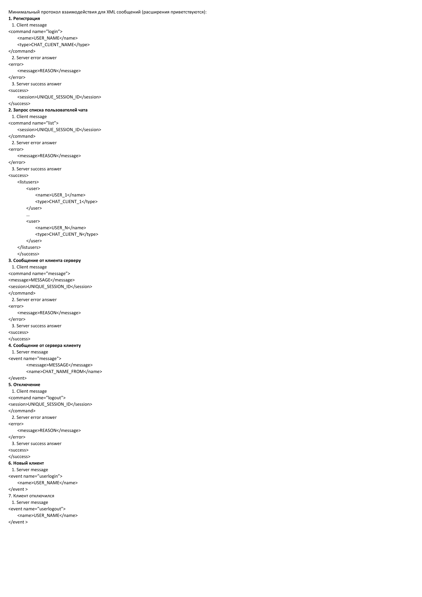

Факультет Информационных Технологий,  2-й курс, VI семестр
Курс: Объектно-ориентированное программирование

Задание №5. (25+15 баллов) Сетевое программирование, сериализация, XML.

1. Напишите программу для общения через Internet. Программа должна состоять из двух частей: сервер и клиент. Сервер стартует в качестве отдельного приложения на определенном порту (задано в конфигурации). Клиент в виде приложения на Swing подсоединяется к серверу по имени сервера и номеру порта.
2. Минимальные возможности чата:
* каждый участник чата имеет собственный ник, который указывается при присоединению к серверу.
* можно посмотреть список участников чата.
* можно послать сообщение в чат (всем участникам).
* клиент показывыает все сообщения, которые отправили в чат с момента подключения +  некоторое число, отправленных до; список сообщений обновляется в онлайне.
* клиент отображает такие события как: подключение нового человека в чат и уход человека из чата. Сервер должен корректно понимать ситуацию отключения клиента от чата (по таймауту).
* сервер должен логгировать все события, которые происходят на его стороне (включается/отключается в конфигурационном файле).
* чат работает через TCP/IP протокол.
3. Необходимо создать 2 версии клиента/сервера. Первый вариант сериализацию/десериализацию Java-объектов  для посылки/приема сообщений (25 баллов), второй - использует XML сообщения (+15 баллов). 
4. Клиент и сервер должны поддерживать стандартный протокол для XML варианта. Это необходимо для возможности общение между клиентами, созданными разными учениками. Протокол описан ниже. Расширения протокола приветствуются, например можно добавить, чтобы пользователь мог выбрать цвет сообщений.
Вначале XML сообщения идут 4 байта (Java int) с его длиной. То есть сначала читаются первые 4 байта и узнается длина оставшегося сообщения (в байтах). Затем считывается само сообщение и далее обрабатывается как XML документ.
5. Рекомендуется использовать следующие техники:
* Сервер слушает порт с помощью класса java.net.ServerSocket
* Клиент подсоединяется к серверу с помощью класса java.net.Socket
* XML сообщение читать с помощью DOM parser:
DocumentBuilderFactory.newInstance().newDocumentBuilder().parse()
* Сериализация/десериализация объекта выполняется через классы ObjectInputStream и ObjectOutputStream

